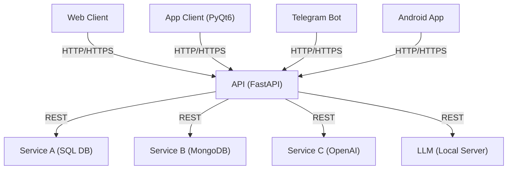
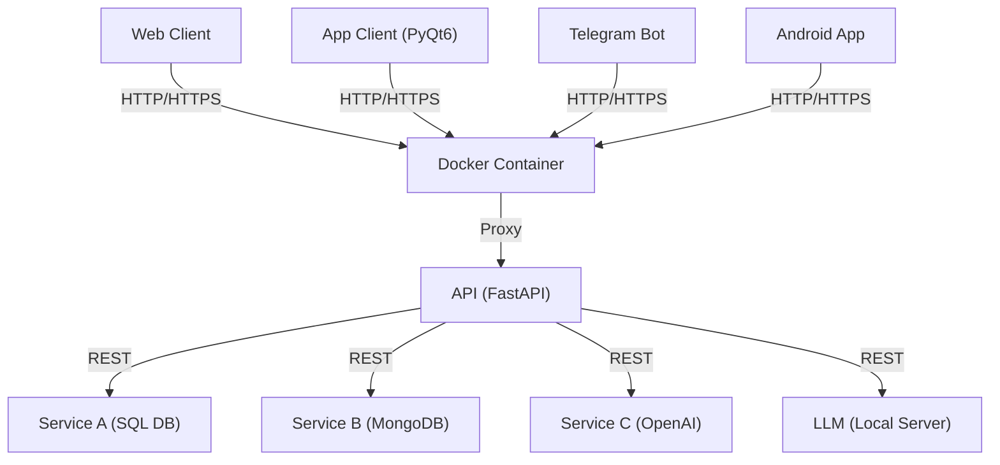
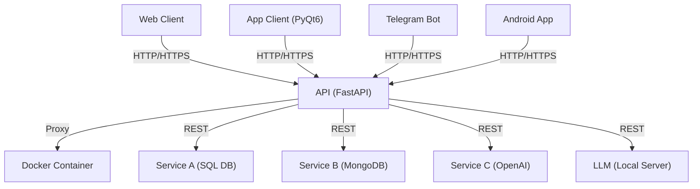

## Схема 1 на языке mermaid:


Здесь клиент ("Client Web/App") соединяется с API ("API FastAPI") через HTTP или HTTPS. 
Затем API перенаправляет запросы к различным службам ("Service A", "Service B", "Service C") через API вызовы.

---

## Схема 3 на языке mermaid:



---

## Схема 4 на языке mermaid:



---

### Ex.1

```stl
solid cube_corner
  facet normal 0.0 -1.0 0.0
    outer loop
      vertex 0.0 0.0 0.0
      vertex 1.0 0.0 0.0
      vertex 0.0 0.0 1.0
    endloop
  endfacet
  facet normal 0.0 0.0 -1.0
    outer loop
      vertex 0.0 0.0 0.0
      vertex 0.0 1.0 0.0
      vertex 1.0 0.0 0.0
    endloop
  endfacet
  facet normal -1.0 0.0 0.0
    outer loop
      vertex 0.0 0.0 0.0
      vertex 0.0 0.0 1.0
      vertex 0.0 1.0 0.0
    endloop
  endfacet
  facet normal 0.577 0.577 0.577
    outer loop
      vertex 1.0 0.0 0.0
      vertex 0.0 1.0 0.0
      vertex 0.0 0.0 1.0
    endloop
  endfacet
endsolid
```
---

## Схема 3 на языке mermaid:




